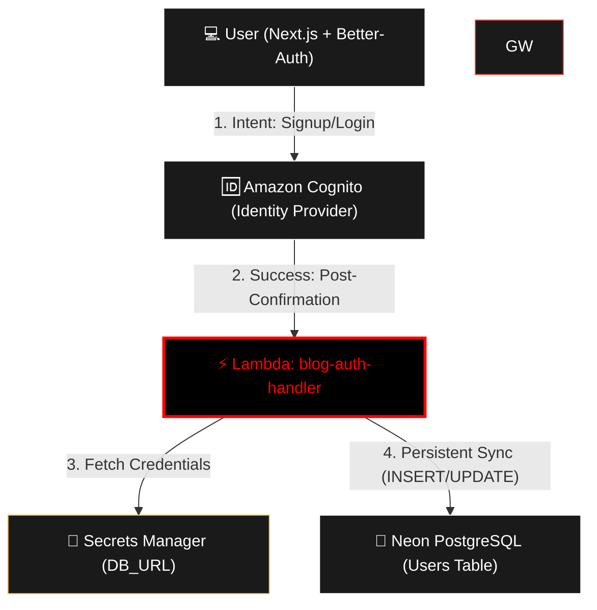

# 🚀 blog-auth-handler

This repository contains the **AWS Lambda** function (Python) responsible for synchronizing users with the **Neon (PostgreSQL)** database. It acts as an **Amazon Cognito Post-Confirmation Trigger** within the **Better-Auth** authentication workflow.

## 🏗️ Architecture: Identity-First Flow

Following industry best practices, the database is only updated once the user's identity has been verified and confirmed by the Identity Provider (Cognito).

