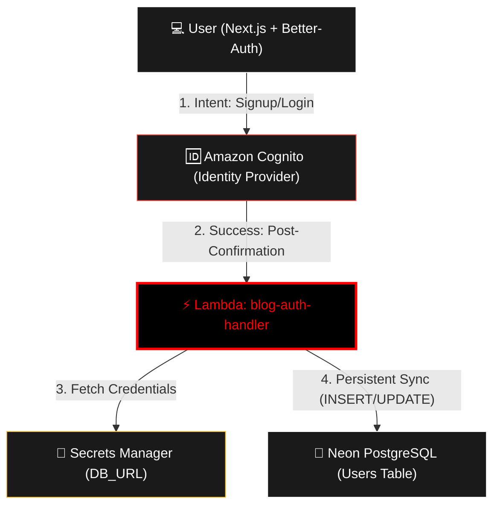

# 🚀 blog-auth-handler

Este repositorio contiene la función **AWS Lambda** escrita en **Python** que gestiona la persistencia de usuarios en la base de datos **Neon (PostgreSQL)**. Funciona como un disparador (Trigger) de **Amazon Cognito** dentro del flujo de autenticación de **Better-Auth**.

## 🏗️ Arquitectura: Identity-First Flow

Siguiendo las mejores prácticas, la base de datos solo se actualiza una vez que la identidad ha sido confirmada por el proveedor (Cognito).

